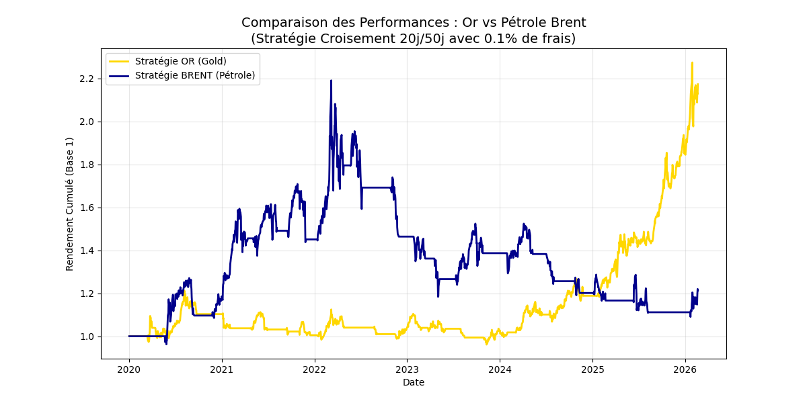

# Commodity Quantitative Toolbox 

The goal of this toolbox is to bridge the gap between theoretical financial models and operational market realities. Unlike equities, commodities exhibit unique volatility patterns and geopolitical sensitivity, making them ideal for testing model robustness.

It integrates three main PROJECTS: derivative pricing, risk management, and algorithmic strategy backtesting.

##  Included Projects

### PROJECT 1:  Option Pricing Engine (Monte Carlo & Black-Scholes)

**Objective**: Analyze the convergence between analytical and numerical pricing methods.

- **Methodology**: Implementation of the **Black-Scholes-Merton** (BSM) model compared against a **Monte Carlo** (MC) simulation with 250,000 trajectories
- **Data Calibration**: Models are calibrated using **Historical Volatility** (log-returns standard deviation) and the **10-Year Treasury Note** as the risk-free rate ($r$). And historical volatility is extracted from **yahoo finance**.
- **Risk Metrics**: Calculation of Greeks ($\Delta, \Gamma, \nu, \theta, \rho$) to demonstrate how price sensitivity evolves with market movements.
- **conclusion**: The Monte Carlo engine serves to validate the BSM price, demonstrating that as $N \to \infty$, the numerical estimate converges to the theoretical price, ensuring accuracy for complex instruments.

### PROJECT 2: Market Risk - Value at Risk (VaR)

**Objective**: Quantify the maximum potential loss in a commodity portfolio over a 1-day horizon.

- **Methodology**: **Rolling Historical VaR** (95% & 99% confidence levels) using a 252-day sliding window.
- **Assets Analyzed**:
    . **Gold (GC=F)**: Chosen as a "Safe Haven" asset to observe VaR stability during market stress
    . **Brent Crude Oil (BZ=F)**: Chosen for its high volatility and "Fat Tail" distribution.
- **Historical VaR** calculation using real-market data (via Yahoo Finance).
- **Backtesting**: The model's reliability is stress-tested against real price movements.
- **Key Result**: Achieved a 3.93% failure rate for the 95% VaR, validating the model's predictive power according to Basel III standards.
  
### PROJECT 3: Quantitative Trading Strategy

**Objective**: Evaluate the profitability of a momentum-based strategy in different commodity regimes.

- **Strategy**: Moving Average Crossover (SMA 50/200).
- **Market Realism**: Integration of **0.1% transaction costs** per trade to account for slippage and commissions.
- **Performance Metrics**: Focus on **Sharpe Ratio** (risk-adjusted return).
- **Insight**: By comparing Gold and Brent, the project demonstrates how momentum strategies perform differently in "trending" vs "mean-reverting" market environments.

### PROJECT 4: Structured Product Pricing - Step-Down Autocall

**Objective**: Price a complex, path-dependent "Step-Down Phoenix" Autocall on the **CAC 40** using an optimized Monte Carlo engine.

- **Product Structure**:
    - **Maturity**: 10 years with annual observation dates.
    - **Step-Down Mechanism**: The early redemption (Autocall) threshold decreases by **5% per year** (from 100% down to 55%), increasing the probability of recall in bearish or sideways markets.
    - **Phoenix Coupon**: 8% annual coupon with **Memory Effect** (unpaid coupons are stored and paid if the coupon barrier is regained at any observation date).
    - **Barriers**: A **Coupon Barrier (70%)** and a **Protection Barrier (60%)** to protect capital at maturity.
- **Quantitative Methodology**:
    - **Antithetic Variates**: Implementation of variance reduction by generating perfectly symmetrical price paths ($Z$ and $-Z$). This halves the statistical noise and significantly tightens the Confidence Interval.
    - **Vectorized Simulation**: Utilizes NumPy's broadcasting and boolean masking to process 100,000 trajectories simultaneously, avoiding slow Python loops.
    - **Performance Tracking**: The engine calculates the **Expected Life** (Duration), **Probability of Recall**, and **Probability of Capital Loss** (Barrier Breach).
- **Market Calibration**: 
    - **Real-Time Data**: Dynamically pulls the CAC 40 (`^FCHI`) spot price and historical volatility via the Yahoo Finance API.
    - **Dividend Impact**: Models the "Price Return" nature of the index by integrating a dividend yield ($q$) as a continuous leakage factor in the Geometric Brownian Motion (GBM).
- **Key Metric (95% CI)**: The script provides a **95% Confidence Interval** based on the Standard Error ($1.96 \times \frac{\sigma}{\sqrt{N}}$) to ensure the numerical estimate's precision.

  
##  Tech Stack & Requirements

- **Language**: Python 3.9+ (All comments and documentation in English)
- **Data Source**: Yahoo Finance API (yfinance)
- **Libraries used**: NumPy, Pandas, Matplotlib, SciPy, yfinance
  
```bash
pip install -r requirements.txt


